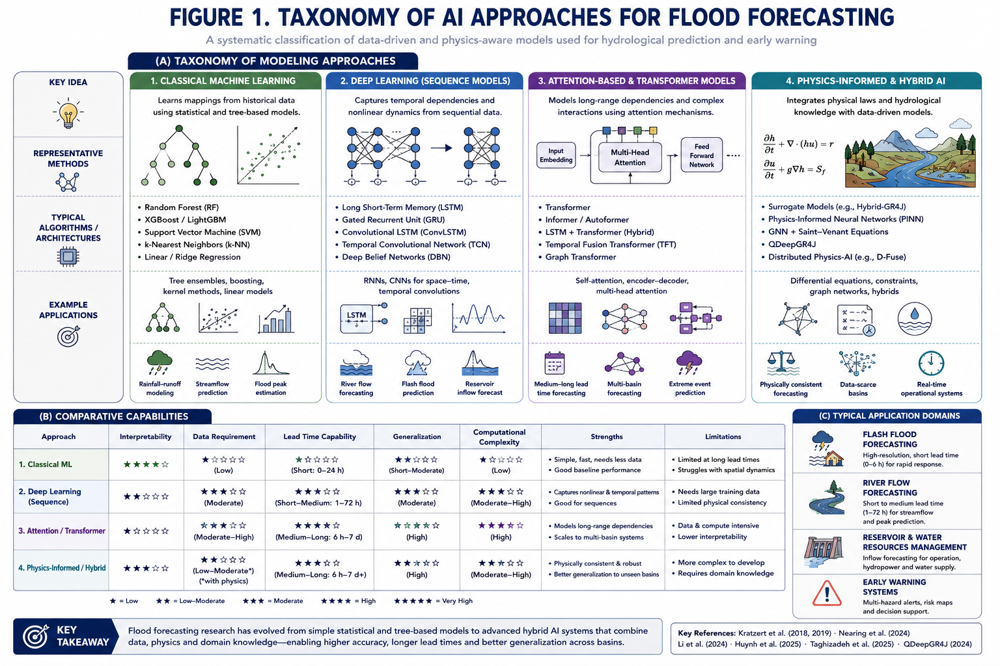
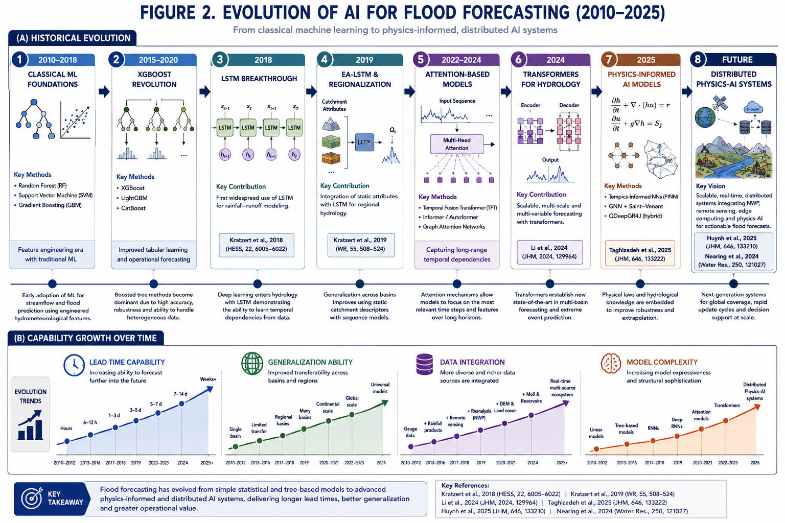
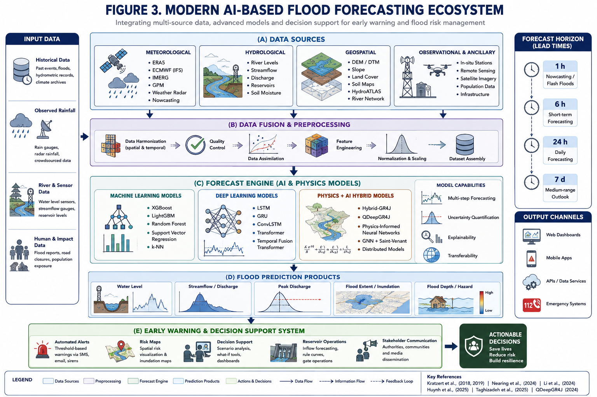
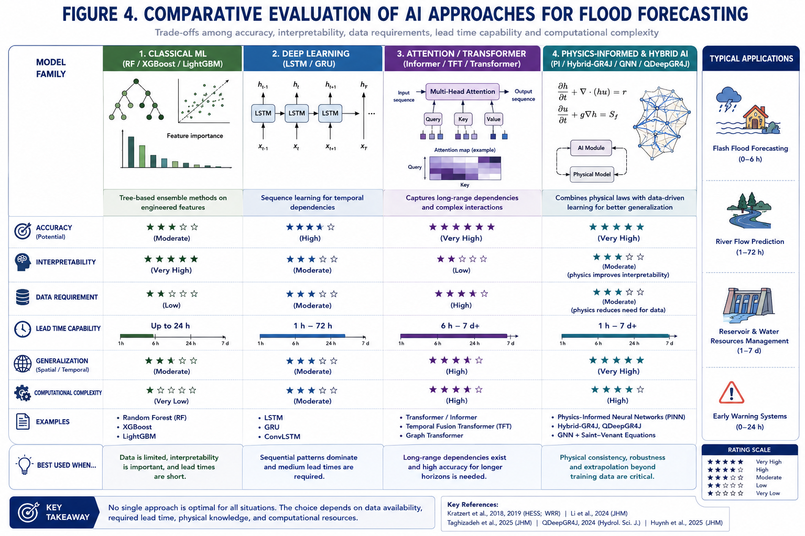
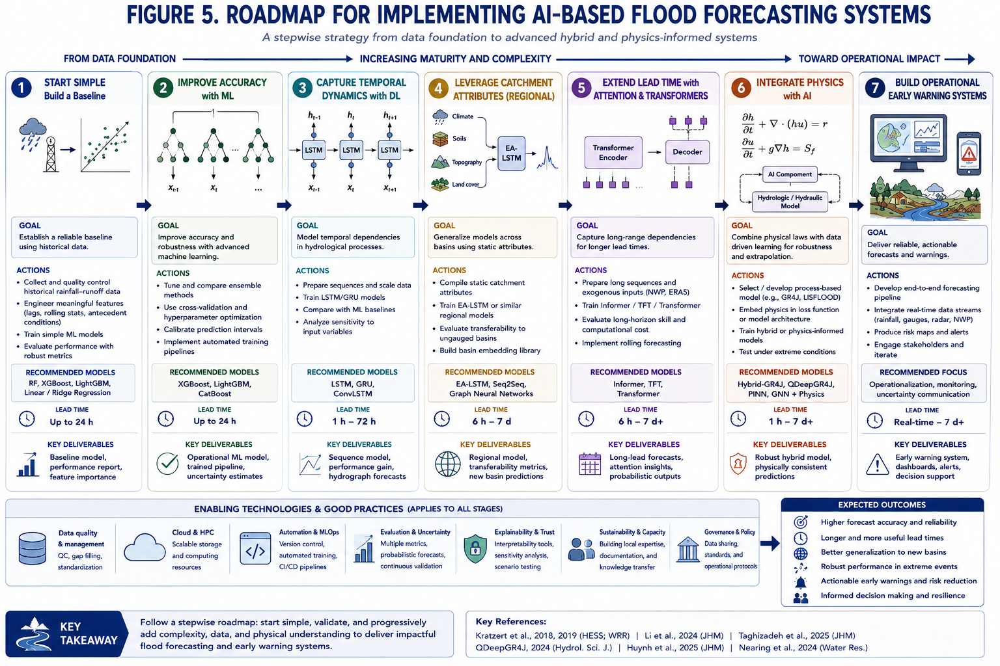

# Revisión de Literatura
**Flood Forecasting con Machine Learning y Enfoques Híbridos**

**Datos · Modelos · Ventanas temporales · Lead times · Métricas**

Este informe organiza el estado del arte en pronóstico de crecientes (flood forecasting) clasificando las publicaciones en tres categorías: ML clásico, deep learning puro, y enfoques híbridos (física + ML). Para cada categoría se detallan los datos usados, la arquitectura del pronóstico (ventana de entrada, lead time) y las métricas de desempeño reportadas.
Fuentes principales: Kratzert et al. 2018/2019, Nearing et al. Nature 2024, Li et al. Sci. Reports 2024, Kumar et al. AIMS 2025, Frame et al. HESS 2022, Nguyen et al. River 2024, Hybrid-GR4J EMS 2025, QDeepGR4J JHydrol 2025, Huynh et al. HESS 2025, Taghizadeh et al. CACIE 2025, y revisiones de Water Resources Management 2025.

## 0. Taxonomía de enfoques

*Figura 1. Taxonomía de enfoques de IA para flood forecasting: clasificación sistemática de métodos data-driven y physics-aware.*
, con características operacionales distintas:

| Categoría | Descripción | Ventaja principal | Limitación principal |
| :--- | :--- | :--- | :--- |
| ML clásico | RF, SVM, XGBoost, GBM sobre features temporales ingeniados manualmente | Robusto con pocos datos; interpretable; rápido | No captura dependencias temporales largas; requiere feature engineering |
| DL puro — LSTM / GRU | Redes recurrentes entrenadas end-to-end sobre series temporales brutas | Captura dinámica rainfall-runoff; modelos regionales multibasin | Requiere años de datos; black-box; subestima picos extremos |
| DL puro — Transformer / híbrido DL | Atención multi-head ± LSTM; captura contexto largo y corto plazo | Mejor estabilidad con lead times largos | Data-hungry; hiperparametrización compleja |
| Híbrido física + ML | Modelo conceptual (GR4J, HEC-HMS, SWAT) acoplado con DL como sustituto o corrector | Interpretable; generaliza mejor fuera de distribución | Requiere modelo físico calibrado como componente previo |

*Figura 2. Evolución histórica (2010–2025): de ML clásico a sistemas distribuidos physics-informed.*

## 1. ML Clásico
Modelos: Random Forest (RF), Support Vector Machine/Regression (SVM/SVR), XGBoost / LightGBM, Gradient Boosting Machines (GBM).

### 1.1  Datos de entrada

| Variable de entrada | Fuente típica | Resolución temporal | Notas |
| :--- | :--- | :--- | :--- |
| Precipitación observada | Pluviómetros | Horaria / sub-horaria | Feature principal; se agregan sumas acumuladas |
| Nivel de río / caudal | Sensores de nivel, limnígrafos | Horaria | Variable objetivo Y también feature lagged |
| Temperatura | Estaciones meteorológicas | Diaria / horaria | Relevante para nieve y ET |
| Índice de precipitación antecedente (API) | Calculado a partir de series de lluvia | Diaria | Proxy de humedad de suelo; frecuente en RF/SVM |
| Atributos estáticos de cuenca | DEM, mapas de suelos, land cover | Estático | Área, pendiente, número de curva CN, cobertura |
| Features temporales ingeniadas | Calculadas sobre la serie | — | Estadísticas en ventanas: media 1h, 3h, 6h, 24h; lag t-1, t-2, … |

### 1.2  Arquitectura del pronóstico

| Parámetro | Rango típico reportado | Referencia |
| :--- | :--- | :--- |
| Ventana de entrada (lookback) | 1–72 h de datos observados; API a 7–30 días | Kumar et al. 2025; Water Res. Mgmt. 2025 |
| Lead time (horizonte de pronóstico) | 1–6 h (flash flood); hasta 1–3 meses (escorrentía mensual con NWP) | Water Res. Mgmt. 2025; KGE study Iran 2020 |
| Frecuencia de update | Horaria (operacional); diaria (planificación) | — |
| Feature engineering | Lag features t-1…t-k; medias rodantes; FFT de lluvia; API | Revisión sistemática 2025 |

### 1.3  Desempeño reportado

| Modelo | Lead time | Métrica | Valor |
| :--- | :--- | :--- | :--- |
| Random Forest | 1–6 h | NSE | 0.71–0.85 |
| Random Forest (nivel mensual) | Mensual | R² | 0.87–0.92 |
| XGBoost | 1–6 h | NSE | 0.71–0.85 |
| XGBoost (mensual) | 1–3 meses | KGE' | 0.60–0.68 |
| SVM | Evento | Accuracy | 0.96 (clasificación binaria) |
| SVM (agua nivel) | Mensual | R² | 0.88 |
| Gradient Boosting | 1–6 h | NSE | 0.71–0.85 |
| Ranking general 1–6 h | — | NSE / R² | 0.71–0.85 para RF/XGBoost/GBM; decae a 0.55–0.65 en 6–12 h |

Nota: para datos escasos (< 5 años), XGBoost/LightGBM suelen ser los más confiables. Los modelos de árbol no capturan memoria hidrológica larga y requieren features manuales que codifiquen el estado antecedente.

*Figura 3. Ecosistema moderno de flood forecasting basado en IA: fuentes de datos, motores de predicción y sistemas de alerta temprana.*

## 2. Deep Learning Puro

### 2.1  LSTM / GRU / GRU con atención
Arquitecturas principales: LSTM estándar (Kratzert 2018); EA-LSTM con atributos de cuenca (Kratzert 2019); Encoder-Decoder LSTM para multi-step; GRU; ConvLSTM (datos espaciales); STA-GRU (atención espacio-temporal).
2.1.1  Datos de entrada

| Variable | Fuente | Resolución | Papel en el modelo |
| :--- | :--- | :--- | :--- |
| Precipitación observada | Pluviómetros / radar / IMERG | Horaria / sub-horaria | Forcing dinámico principal |
| Temperatura (T2M) | Estaciones / ERA5-Land / ECMWF IFS | Horaria / diaria | Controla ET, nieve; usado en LSTM regional |
| Radiación solar neta (SSR/STR) | ERA5-Land / ECMWF IFS | Horaria | Forzante del balance energético |
| Nivel / caudal observado | Sensores in-situ | Horaria | Target Y; también como feature de estado del sistema |
| Precipitación futura NWP | ECMWF IFS HRES, ERA5 hindcast | Diaria (operacional) | Extiende lead time más allá del tiempo de concentración |
| Atributos estáticos de cuenca (EA-LSTM) | HydroATLAS, CAMELS | Estáticos | Área, pendiente, tipo suelo, LULC, clima |
| Análisis de lag de flujo entre subcuencas | Calculado entre estaciones upstream-downstream | — | Información de tiempo de tránsito; mejora NSE en cuencas grandes |

El paper de Nearing et al. (Nature, 2024) usó: ERA5-Land + ECMWF IFS + CPC Unified Gauge + IMERG (4 fuentes de precipitación) + 6 variables atmosféricas + atributos de cuenca HydroATLAS. El dataset cubre 5680 cuencas globales con series históricas de aproximadamente 30 años en promedio, lo que resulta en ~152 000 años-cuenca de entrenamiento en total (152 259 según el preprint arxiv:2307.16104), ocupando 60 GB en disco.

2.1.2  Arquitectura temporal del pronóstico

| Parámetro | Valor típico | Referencia |
| :--- | :--- | :--- |
| Ventana de entrada (lookback) | 24–365 pasos (típico: 30–90 días a escala diaria; 24–72 h a escala horaria) | Kratzert 2018; Kim 2025 |
| Paso de tiempo | Horario (flash flood, 1–6 h lead) o diario (cuencas grandes, 1–7 días lead) | Frame 2022; Nearing 2024 |
| Lead time alcanzable sin NWP | ≈ tiempo de concentración de la cuenca (horas a días) | Kim 2025 |
| Lead time alcanzable con NWP | Hasta 5–7 días (Nearing 2024); hasta 15 días con lag de flujo aguas arriba | Nearing 2024; novel LSTM con PFL 2024 |
| Lag de lluvia (LR) optimizado | = tiempo de concentración de la cuenca; varía 1–72 h; optimizable con GA | LSTM-GA Taiwan 2023 |
| Tamaño del estado oculto | 128–512 neuronas (depende del dataset) | Kratzert 2019; NeuralHydrology docs |
| Épocas de entrenamiento | 30–100 épocas; early stopping por NSE en validación | NeuralHydrology |

2.1.3  Desempeño reportado

| Modelo / estudio | Lead time | NSE / KGE | Cuencas / escala |
| :--- | :--- | :--- | :--- |
| LSTM (Kratzert 2018) | Diario, t+1 | NSE > SAC-SMA (ref. 0.29 → 0.65+) | 241 cuencas CAMELS-US |
| EA-LSTM (Kratzert 2019) | Diario, t+1 | NSE mediana ~0.73 | 531 cuencas CAMELS-US |
| LSTM (Frame 2022, extremos) | Diario, t+1 | NSE mediana > NWM (0.62) | 531 cuencas CAMELS-US |
| LSTM (Nearing 2024) | Diario, 1–7 días | NSE a 5 días ≈ NSE modelos físicos a t=0 | 5.680 cuencas globales |
| LSTM (Kim 2025, nivel horario) | 1–3 h | Alta precisión (NSE > 0.90 reportado) | Cuencas Corea del Sur |
| LSTM con lag de flujo H(15)_PFL | 15 días | KGE 0.948 / NSE 0.940 | Cuenca Dulong-Irrawaddy |
| LSTM-GA (GA-optimizado) | 1–6 h | NSE 0.917–0.931 | Río Wu, Taiwán |
| STA-GRU (atención espacio-temporal) | Hasta 24 h | Superior a LSTM puro | Benchmarks China |
| ED-DLSTM (encoder-decoder) | Multi-step | NSE medio 0.75 en 2.000+ cuencas | CAMELS + cuencas Chile |

### 2.2  LSTM + Transformer (híbridos DL)
Combinan la memoria secuencial del LSTM con el mecanismo de atención del Transformer para mejorar la estabilidad a lead times largos.

| Modelo | Lead time | NSE | Notas |
| :--- | :--- | :--- | :--- |
| RS-LSTM-Transformer (Li 2024) | 1 h | 0.970 (calibración) / 0.953 (validación) | Random Search para hiperparámetros; mejor que LSTM solo |
| AGRS-LSTM-Transformer (ScienceDirect) | 1–6 h | NSE > 0.905 en todos los lead times | Atributos de cuenca como input adicional |
| Transformer encoder-decoder (tropical) | 1–3 días | Comparable a LSTM; ventaja en contextos largos | Cuencas monzónicas Sri Lanka / China |
| ConvLSTM (Oddo 2024) | Sub-horario / 1–3 h | Superior a LSTM 1D en flash floods | Usa datos multi-modales espaciales (radar) |

## 3. Enfoques Híbridos — Física + ML
Se distinguen dos subcategorías conceptualmente diferentes:
- Surrogate models: el DL aprende a emular outputs de un modelo físico (HEC-RAS 2D, LISFLOOD-FP). El modelo físico genera datos de entrenamiento.
- Physics-informed / coupled models: ecuaciones físicas se embeben en la arquitectura del DL (GNN con Saint-Venant, priors estructurales en LSTM). El DL corrige residuos del modelo conceptual.

### 3.1  Subcategoría A: surrogate models (DL ← modelo físico)

| Modelo físico base | Componente DL | Datos de entrenamiento | Lead time | Resultado clave |
| :--- | :--- | :--- | :--- | :--- |
| HEC-RAS 2D / LISFLOOD-FP | CNN / DL sustituto | Simulaciones del modelo hidráulico 2D | Tiempo de propagación de inundación | ~100× más rápido que simulación completa; similar precisión en mapas de inundación |
| HEC-HMS + ANN (Nguyen 2024) | Encoder-Decoder LSTM como corrector | 33 eventos 2016–2021 calibrados en HEC-HMS | t+1 a t+6 h | ΔKGEdelta=16% at t+1h → 69% at t+6h vs HEC-HMS solo |
| GR4J + DL (Hybrid-GR4J 2025) | RNN estructuralmente integrado | Daily CAMELS-US 569 cuencas | Diario t+1 | NSE 0.59 / KGE 0.63; +23% vs RNN; +37% vs GR4J solo |
| SWAT + ensemble ML | RF / XGBoost sobre outputs SWAT | Outputs simulados + observaciones calibradas | Diario | Mayor precisión en pico de descarga que SWAT solo |
| WRF-Hydro + LSTM (Frame 2021) | LSTM como post-procesador | Salidas del NWM para 531 cuencas | Diario | NSE aumenta en mayoría de cuencas; reduce error en timing de picos |

### 3.2  Subcategoría B: physics-informed (ecuaciones en la arquitectura)

| Modelo / estudio | Enfoque físico embebido | Datos | Lead time | Resultado clave |
| :--- | :--- | :--- | :--- | :--- |
| QDeepGR4J (Rashid 2025) | GR4J como backbone; DL reemplaza routing; quantile regression para incertidumbre | Daily rainfall + streamflow; cuencas áridas Australia | 3 días | Captura incertidumbre en picos extremos; validado como sistema de alerta |
| Hybrid physics-AI distribuido (Huynh 2025) | Modelo físico diferenciable + NN que aprende correcciones a flujos internos (ET, subsuperficial) | Datos distribuidos multi-fuente; ERA5 + in-situ | Horario / diario | Mejora regionalización a alta resolución; primero distribuido con este enfoque |
| Physics-informed GNN (Taghizadeh 2025) | Ecuaciones de Saint-Venant simplificadas en capas del GNN; interpretabilidad vía pesos = parámetros hidráulicos | Red fluvial como grafo; datos de nivel + geometría | Horas | Más eficiente que PINNs clásicos; no requiere re-entrenamiento al cambiar geometría |
| Explainable DL con priors físicos (HESS 2025) | Leyes hidrológicas como priors estructurales (ecuaciones de balance hídrico en arquitectura) | Datos de cuenca estándar | Horario / diario | Mejor extrapolación a eventos extremos; interpretabilidad mejorada vs LSTM black-box |
| ANN + WEAP (Patel 2024) | WEAP (Water Eval. & Planning) como modelo físico; ANN corrige residuos | Subcuenca alta Narmada, India; datos históricos de lluvia y caudal | Diario | NSE 0.955 (train) / 0.923 (test); R²=0.96; supera modelos individuales |

## 4. Datos de entrada — comparativa por categoría

| Dato / fuente | ML clásico | DL puro | Híbrido |
| :--- | :--- | :--- | :--- |
| Precipitación observada (pluviómetros) | ✓ Obligatorio | ✓ Obligatorio | ✓ Obligatorio |
| Nivel / caudal observado (sensores) | ✓ Obligatorio | ✓ Obligatorio (target + feature) | ✓ Obligatorio |
| Temperatura (T2M) | Opcional | ✓ Frecuente (balance energético) | ✓ Frecuente |
| Pronóstico NWP (ej. ECMWF IFS) | Raro (features exógenas) | ✓ Clave para lead time > tiempo concentración | ✓ Clave en sistemas operacionales |
| Reanálisis ERA5 / ERA5-Land | Raro | ✓ Estándar en modelos globales | ✓ Forzante en modelos distribuidos |
| Atributos estáticos de cuenca | Ocasional (features en tabla) | ✓ Obligatorio en EA-LSTM regional | ✓ Obligatorio en modelos distribuidos |
| Humedad de suelo (SMAP, CCI) | Raro | Investigación (mejora en eventos extremos) | Prometedor (asimilación de datos) |
| DEM / red fluvial como grafo | No | ConvLSTM / GNN espaciales | ✓ Obligatorio en GNN con Saint-Venant |
| Salidas de modelo físico calibrado | No | No (es DL puro) | ✓ Obligatorio en surrogates |
| Registros históricos de eventos | Mínimo 3–5 años horarios | Mínimo 5–10 años; óptimo 20+ | Según modelo físico base; puede ser < 5 años |

*Figura 4. Evaluación comparativa de familias de modelos: precisión, interpretabilidad, requerimientos de datos, lead time y complejidad computacional.*

## 5. Capacidad de lead time por enfoque

| Categoría | Lead time sin NWP | Lead time con NWP | Limitante principal |
| :--- | :--- | :--- | :--- |
| ML clásico (RF / XGBoost) | 1–6 h | 1–3 meses (con features NWP) | Feature engineering manual; no memoria temporal endógena |
| LSTM / GRU puro | ≈ tiempo concentración cuenca (1–12 h) | Hasta 5–7 días (Nearing 2024) | Requiere NWP para extender; incertidumbre crece con lead time |
| LSTM + Transformer | 1–6 h | Multi-day con NWP | Más data-hungry; hiperparametrización |
| Surrogate (física → DL) | = modelo físico base | = modelo físico base | Requiere modelo físico calibrado upstream |
| Physics-informed DL | Horas (Saint-Venant) a días (GR4J-DL) | Días con NWP | Complejidad de implementación; requiere conocimiento de ecuaciones |

Regla práctica: sin pronóstico meteorológico el lead time máximo alcanzable es aproximadamente el tiempo de concentración de la cuenca (tiempo desde que empieza a llover hasta que se registra el pico en la salida). Para cuencas pequeñas y montañosas esto puede ser 30 min a 3 h; para cuencas grandes, días. Los NWP (ERA5, ECMWF IFS, modelos regionales) son el principal palanca para extender ese horizonte.

## 6. Métricas de evaluación

| Métrica | Fórmula / descripción | Uso |
| :--- | :--- | :--- |
| NSE (Nash-Sutcliffe Efficiency) | 1 − Σ(Q_obs − Q_sim)² / Σ(Q_obs − Q̄_obs)²  |  rango (−∞, 1] | Estándar en hidrología; NSE > 0.65 = bueno; > 0.75 = muy bueno |
| KGE (Kling-Gupta Efficiency) | 1 − √[(r−1)² + (α−1)² + (β−1)²]  |  rango (−∞, 1] | Descompone error en correlación, sesgo y variabilidad; KGE > 0.5 = aceptable |
| RMSE | √(Σ(Q_obs − Q_sim)² / n) | Penaliza errores grandes; en m³/s o m |
| MAE | Σ|Q_obs − Q_sim| / n | Robusto a outliers |
| R² (coeficiente de determinación) | Correlación al cuadrado entre obs y sim | Usado en ML clásico; no penaliza sesgo sistemático |
| Bias / RE (relative error) | (Q̄_sim − Q̄_obs) / Q̄_obs × 100 | Detecta sub/sobreestimación sistemática |
| CSI / F1 (para alerta binaria) | TP / (TP + FP + FN) | Para umbral de creciente: precisión de detección del evento |

*Figura 5. Hoja de ruta de implementación: estrategia escalonada desde modelos base hasta sistemas operacionales de alerta temprana.*

## 7. Relevancia para el equipo — mapa de gaps

| Recurso / dato | ¿Lo tienen? | Importancia | Acción sugerida |
| :--- | :--- | :--- | :--- |
| Pluviómetros (lluvia observada) | Sí | Crítica | Base del modelo; verificar resolución temporal (¿horaria?) |
| Sensores de nivel | Sí | Crítica | Variable objetivo; verificar series históricas completas |
| Años de datos históricos (> 5 años) | ¿? | Alta | Confirmar en reunión; mínimo 3–5 años para LSTM local |
| Atributos morfológicos de cuenca | ¿? | Alta (para EA-LSTM regional) | Área, pendiente, tipo de suelo, LULC — habilitarían modelo regional |
| Pronóstico NWP (ej. ECMWF, GFS) | Probablemente no | Alta (para lead time > Tc) | Evaluar acceso a ERA5 (gratuito) o pronóstico operacional regional |
| Registros de eventos pasados etiquetados | ¿? | Media-alta | Para métricas de alerta temprana (CSI/F1) y análisis de picos extremos |
| Modelo físico calibrado (HEC-HMS, GR4J) | ¿? | Media (si se busca híbrido) | Si ya existe, el enfoque surrogate o corrector ANN es muy directo |

Recomendación de orden de ataque:
- Fase 1 — Línea de base: XGBoost con features de lag manual. Requiere lo mínimo (lluvia + nivel); rápido de implementar; sirve como benchmark.
- Fase 2 — DL local: LSTM por cuenca con datos propios. Entrenado con NeuralHydrology (pip install neuralhydrology). Evaluar con NSE y KGE.
- Fase 3 — Regional (si tienen atributos de cuenca): EA-LSTM multi-cuenca. Permite predecir en cuencas con pocos datos históricos.
- Fase 4 — Extensión del lead time: integrar ERA5-Land como forzante adicional y/o conectar con pronóstico NWP regional.
- Fase 5 — Híbrido (opcional): si el equipo ya usa un modelo físico, acoplarlo con LSTM corrector (patrón HEC-HMS + ANN de Nguyen 2024) agrega interpretabilidad sin sacrificar precisión.

## 8. Referencias clave
- Kratzert F. et al. (2018). Rainfall-runoff modelling using LSTM networks. Hydrol. Earth Syst. Sci. doi:10.5194/hess-22-6005-2018
- Kratzert F. et al. (2019). Benchmarking a catchment-aware LSTM (EA-LSTM). HESS. doi:10.5194/hess-23-5089-2019
- Frame J. et al. (2022). Deep learning rainfall-runoff predictions of extreme events. HESS. doi:10.5194/hess-26-3377-2022
- Nearing G. et al. (2024). Global prediction of extreme floods in ungauged watersheds. Nature 627. doi:10.1038/s41586-024-07145-1
- Li W. et al. (2024). Hybrid RS-LSTM-Transformer for rainfall-runoff simulation. Scientific Reports. doi:10.1038/s41598-024-62127-7
- Kim H. et al. (2025). Prediction of flood level using LSTM and watershed hydrological data. J. Flood Risk Mgmt. doi:10.1111/jfr3.70123
- Kumar V. et al. (2025). ML applications in flood forecasting — review. AIMS Environmental Science. doi:10.3934/environsci.2025004
- Nguyen P.D. et al. (2024). HEC-HMS + Encoder-Decoder LSTM hybrid for Krong H'nang reservoir. River. doi:10.1002/rvr2.72
- Rashid M. et al. (2025). QDeepGR4J: Quantile deep learning + GR4J for extreme flow prediction. J. Hydrology.
- Hybrid-GR4J (2025). Hybrid hydrological model integrating GR4J and deep learning. Environmental Modelling & Software.
- Huynh N.N.T. et al. (2025). Distributed hybrid physics-AI framework for regionalized flood modeling. HESS. doi:10.5194/hess-29-3589-2025
- Taghizadeh S. et al. (2025). Physics-informed graph neural networks for flood forecasting. Computer-Aided Civil & Infra. Eng. doi:10.1111/mice.13484
- Patel R. et al. (2024). Hybrid ANN + WEAP for rainfall-runoff (Upper Narmada). Scientific Reports. doi:10.1038/s41598-024-77655-5
- Novel time-lag LSTM framework (2024). LSTM with peak flow lag for large-scale basins. J. Hydrology. doi:10.1016/j.jhydrol.2024.00235X
- LSTM-GA (2023). LSTM optimized with Genetic Algorithm for flash flood forecasting. Water Resources Management. doi:10.1007/s11269-023-03713-8
- Review: ML for short-term flood forecasting (2025). Water Resources Management. doi:10.1007/s11269-025-04093-x
- NeuralHydrology library: https://neuralhydrology.github.io (Kratzert et al., JOSS 2022)
